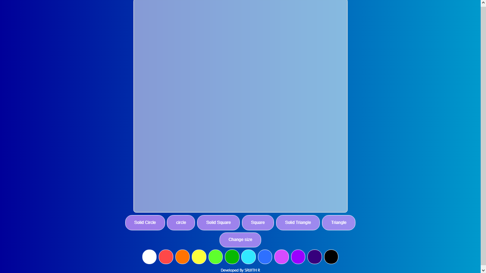
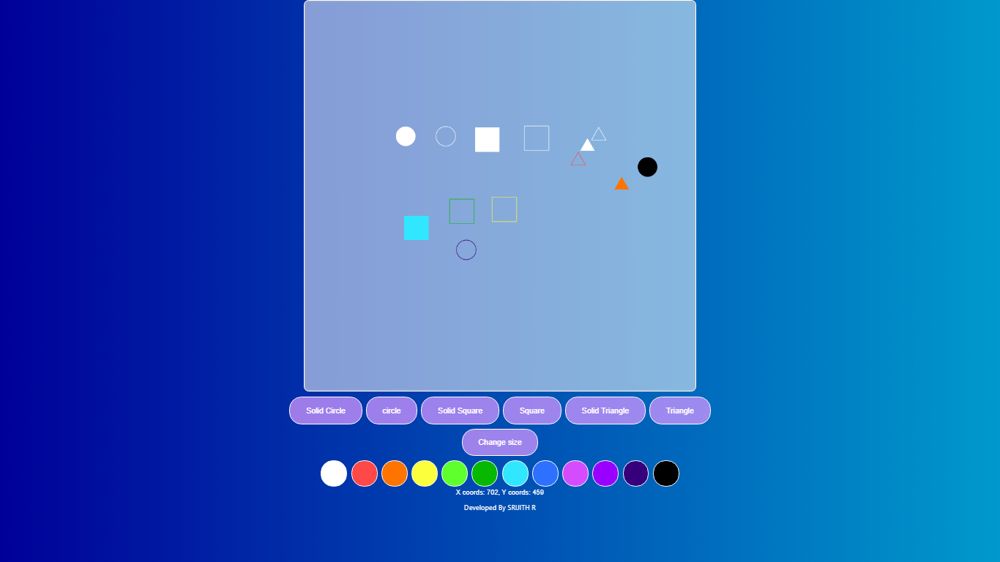
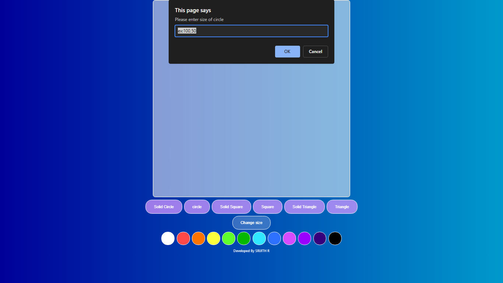

# Web Page for Paint Application

## AIM:

To design a static website for Paint Application using HTML5 canvas.

## DESIGN STEPS:

### Step 1:

Requirement collection.

### Step 2:

Creating the layout using HTML,CSS and canvas.

### Step 3:

Write javascript to capture move events.

### Step 4:

Perform the drawing operation based on the user input.

### Step 5:

Validate the layout in various browsers.

### Step 6:

Validate the HTML code.

### Step 6:

Publish the website in the given URL.

## PROGRAM :

```
<!DOCTYPE html>
<html>

<head>
    <title>Paint Tool</title>
    <meta charset="UTF-8" />
    <meta http-equiv="X-UA-Compatible" content="IE=edge" />
    <meta name="viewport" content="width=device-width, initial-scale=1.0" />
    <link rel="stylesheet" href="https://maxcdn.bootstrapcdn.com/bootstrap/3.4.1/css/bootstrap.min.css">
    <script src="https://ajax.googleapis.com/ajax/libs/jquery/3.5.1/jquery.min.js"></script>
    <script src="https://maxcdn.bootstrapcdn.com/bootstrap/3.4.1/js/bootstrap.min.js"></script>
</head>

<body id="supahatfia">
    <div id="blyat">
        <canvas id="myCanvas" width="800" height="800" onclick="showCoords(event)"></canvas>
    </div>
    <center>
        <button onclick="shape=1" id="jacob">Solid Circle</button>
        <button onclick="shape=2" id="jacob">circle</button>
        <button onclick="shape=3" id="jacob">Solid Square</button>
        <button onclick="shape=4" id="jacob">Square</button>
        <button onclick="shape=5" id="jacob">Solid Triangle</button>
        <button onclick="shape=6" id="jacob">Triangle</button>
        <br>
        <button onclick="size()" id="jacob">Change size</button>
    </center>
    <center>
        <button onclick="change_color(this)" id="sike" style="background: white;"></button>
        <button onclick="change_color(this)" id="sike" style="background: rgb(255, 72, 72);"></button>
        <button onclick="change_color(this)" id="sike" style="background: rgb(255, 115, 1);"></button>
        <button onclick="change_color(this)" id="sike" style="background: rgb(252, 255, 60);"></button>
        <button onclick="change_color(this)" id="sike" style="background: rgb(94, 255, 45);"></button>
        <button onclick="change_color(this)" id="sike" style="background: rgb(7, 184, 1);"></button>
        <button onclick="change_color(this)" id="sike" style="background: rgb(49, 231, 255);"></button>
        <button onclick="change_color(this)" id="sike" style="background: rgb(46, 112, 255);"></button>
        <button onclick="change_color(this)" id="sike" style="background: rgb(213, 76, 255);"></button>
        <button onclick="change_color(this)" id="sike" style="background: rgb(153, 0, 255);"></button>
        <button onclick="change_color(this)" id="sike" style="background: rgb(54, 0, 124);"></button>
        <button onclick="change_color(this)" id="sike" style="background: rgb(0, 0, 0);"></button>
    </center>

    <script>


        const canvas = document.getElementById("myCanvas");
        const ctx = canvas.getContext("2d");
        ctx.fillStyle = "#FF0000";
        canvas.height = canvas.width;
        ctx.transform(1, 0, 0, -1, 0, canvas.height);
        let xMax = canvas.height;
        let yMax = canvas.width;
        let csize = 20;
        let sqsize = 50;
        let tsize = 30;
        let tatakae = "black";
        function size() {
            if (shape == 1 || shape == 2) {
                let c = prompt("Please enter size of circle", "ex:100,50");
                csize = c;
            }
            if (shape == 3 || shape == 4) {
                let s = prompt("Please enter size of square", "ex:100,20");
                sqsize = s;
            }
            if (shape == 5 || shape == 6) {
                let t = prompt("Please enter size of square", "ex:50,84");
                tsize = t;
            }
        }
        function change_color(element) {
            tatakae = element.style.background;
        }

        function showCoords(event) {
            var x = event.clientX - 250;
            var y = yMax - event.clientY;
            var coords = "X coords: " + x + ", Y coords: " + y;
            document.getElementById("demo").innerHTML = coords;

            if (shape == 1) {
                ctx.beginPath();
                ctx.arc(x, y, csize, 0, 2 * Math.PI);
                ctx.fillStyle = tatakae;
                ctx.fill();
            }
            if (shape == 2) {
                ctx.beginPath();
                ctx.arc(x, y, csize, 0, 2 * Math.PI);
                ctx.strokeStyle = tatakae;
                ctx.stroke();
            }
            if (shape == 3) {
                ctx.beginPath();
                ctx.rect(x - (sqsize / 2), y - (sqsize / 2), sqsize, sqsize);
                ctx.fillStyle = tatakae;
                ctx.fill();
            }
            if (shape == 4) {
                ctx.beginPath();
                ctx.rect(x - (sqsize / 2), y - (sqsize / 2), sqsize, sqsize);
                ctx.strokeStyle = tatakae;
                ctx.stroke();
            }
            if (shape == 6) {
                ctx.beginPath();
                ctx.moveTo(x, y);
                ctx.lineTo(x - (tsize / 2), y - (tsize * 0.86602));
                ctx.lineTo(x + (tsize / 2), y - (tsize * 0.86602));
                ctx.lineTo(x, y)
                ctx.strokeStyle = tatakae
                ctx.stroke();
            }
            if (shape == 5) {
                ctx.beginPath();
                ctx.moveTo(x, y);
                ctx.lineTo(x - (tsize / 2), y - (tsize * 0.86602));
                ctx.lineTo(x + (tsize / 2), y - (tsize * 0.86602));
                ctx.fillStyle = tatakae
                ctx.fill();
            }


        }

    </script>
    <center>
        <p id="demo" style="color: white;"></p>
        <p
            style="color: white; font-family: -apple-system, BlinkMacSystemFont, 'Segoe UI', Roboto, Oxygen, Ubuntu, Cantarell, 'Open Sans', 'Helvetica Neue', sans-serif;">
            Developed By SRIJITH R</p>
    </center>
    <style>
        #blyat {
            width: auto;
            align-items: center;
            text-align: center;
            margin-left: auto;
            margin-right: auto;

        }

        #myCanvas {
            background-color: #ffffff86;
            box-shadow: inset 0 0 5px #b6b6b6;
            backdrop-filter: blur(15px);
            border-radius: 10px;
            border: 1px solid #ffffff;
        }

        #jacob {
            background-color: #cf95ffc2;
            border: 2px solid rgb(255, 255, 255);
            border-radius: 25px;
            color: white;
            padding: 15px 32px;
            text-align: center;
            display: inline-block;
            font-size: 16px;
            margin: 4px 2px;
            cursor: pointer;
        }

        #jacob:hover {
            background-color: #ffffff36;
            transition: 0.5s;
        }

        #supahatfia {
            background: linear-gradient(to right, #000099 0%, #0099cc 100%);
        }

        #sike {
            border: 2px solid #ffffff;
            border-radius: 25px;
            padding: 25px 25px;
            text-align: center;
            display: inline-block;
            font-size: 16px;
            margin: 4px 2px;
            cursor: pointer;
        }

        #sike:hover {
            opacity: 20%;
            transition: 0.21s;
        }
    </style>
</body>

</html>
```

## OUTPUT:





## Result:

Thus a website is designed and validated for paint application using HTML5 canvas.
